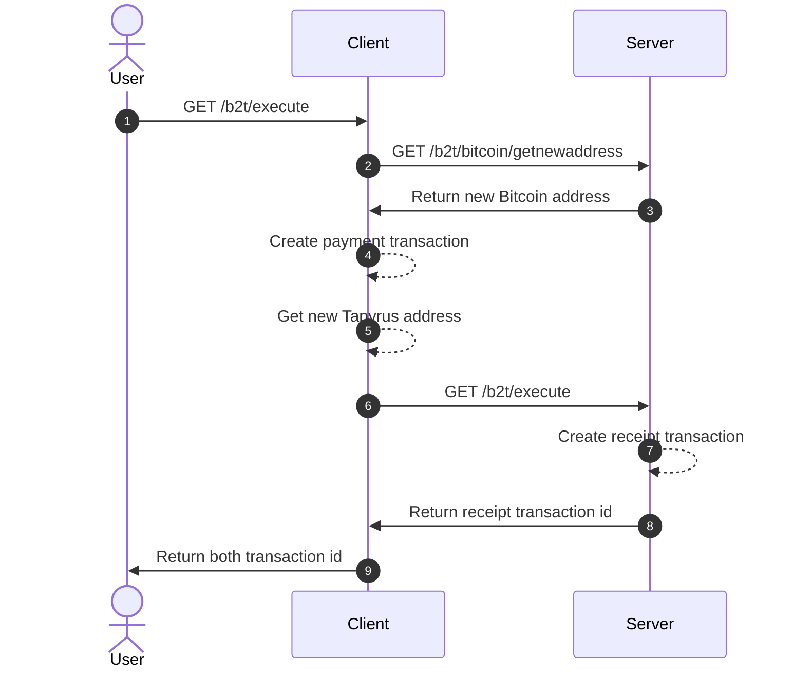

# b2t.server

BTC to TPC server.



## setup

```bash
$ docker compose up -d
```

## usage

localhost:8910 に向けて色々投げる、[専用クライアント](https://github.com/shmn7iii/b2t.client)駆動を想定

- ヘルスチェック  
  http://localhost:4567/health
